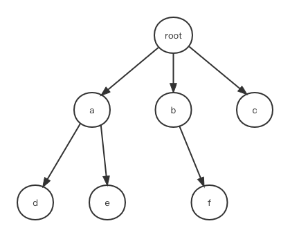

## 内存泄漏以及eslint内存泄漏排查工具开发

> 主要内容有两部分：
>
> 1. 内存泄漏的原因及场景案例
> 2. 根据案例开发eslint内存泄漏排查插件

### 前端内存泄漏问题

#### 内存泄漏原因

像js这种自带垃圾回收机制的语言，产生内存泄漏的原因不外乎是定义了全局的对象、事件，定时器，而没有及时清理，导致随着程序运行，内存占用越来越高。

#### 全局事件

常见于在window、document上添加事件未及时解绑。需要注意的是，绑定事件必须保证`addEvenetListener`和`removeEventListener`参数的一致性

```javascript
const f = function(){}
// eq1 解绑失败，f.bind(this)生成了新的函数对象
window.addEvenetListener('click', f.bind(this))
window.removeEvenetListener('click', f.bind(this))

// eq2 解绑失败，第三个参数不一致
window.addEvenetListener('click', f, false)
window.removeEvenetListener('click', f, true)

// 查看window绑定函数
getEventListeners(window)
```


#### 全局变量

全局变量不一定是指挂在window下的对象，单个js文件中，直接定义该文件在文件全局下的变量也属于全局变量。当某个代码逻辑生命周期中修改了全局变量后，该生命周期结束时，应移除修改部分。

```javascript
import 'echarts' from echarts;
const obj = {};
// 比较危险方法，修改了全局变量obj，且作为导出项，不可控
export const injectData = (key, val) => {
  obj[key] = val;
}

......

// 使用第三方库时，应注意文档中关于创建对象的描述
// echarts.init生成chart对象时，会将该对象挂载在全局的echarts下，调用dispose方法才能销毁
function Comp() {
  useEffect(()=>{
      const chart = echarts.init(element, undefined, opts);
  		chart.setOption(option);
    	// 此处应加上注释中的代码
    	// return () => chart.dispose()
  }, [])
}
```

#### 定时器

诸如`setInterval`、`requestAnimationFrame`这类生成全局定时器的函数，需要在退出对应业务代码生命周期时进行销毁。

常规情况比较容易判断，但异步递归 + `setTimeout`的场景容易被忽略:

```javascript
let timer;
async function loopFetchData() {
  const data = await fetchData();
	timer = setTimeout(()=>{
    loopFetchData();
  }, 3000)
}

......
// 退出生命周期时
clearTimeout(timer)
timer = null
```

如上所示用例，看似在退出生命周期时销毁了定时器，但仔细看便能发现，该操作忽略了fetchData处于**请求中**的状态。

该代码状态如下图所示


若要正确结束递归调用，需结束所有虚线表示的异步代码。

较为合理的方式是定义一个退出循环的判断条件，代码如下所示

```javascript
let toStop;
async function loopFetchData() {
  const data = await fetchData();
  if(toStop) return;
	timer = setTimeout(()=>{
    loopFetchData();
  }, 3000)
}

......
// 进入生命周期时
toStop = false;
......
// 退出生命周期时
toStop = true;
```

如此，代码结构如下，整个过程有了终结态


### eslint内存泄漏排查插件

前面列举了常见的前端内存泄漏情形，是否可以开发一个eslint插件，辅助内存泄漏的排查工作？

> 最近开发进度比较紧，没来得及实现所有内存泄漏场景的插件，只开发了递归调用合法性判定插件。

#### eslint插件开发及原理

这部分内容网上比较多，参考[文章](https://www.jianshu.com/p/e6ee3f64e2ce)

#### 递归调用合法性判定插件

前面说了定时器未回收的问题，我们可以发现，递归调用无论同步异步，最好还是包含`return`，以避免不必要的问题，因此开发了相关插件。地址如下：

+ [代码地址](https://github.com/goblin-pitcher/eslint-study-notes)
+ [对应rules地址](https://github.com/goblin-pitcher/eslint-study-notes/tree/main/eslint-plugin-memory-leak/lib/rules/recursion-return)

测试方式：

+ 全局安装pnpm

+ 进入代码仓库，pnpm install后执行如下操作

  - ```txt
    cd ./test-pkgs
    pnpm link ../eslint-plugin-memory-leak
    npx eslint ./
    ```

  - 可在控制台中查看test-pkgs/index.js文件的错误信息

##### 递归的判定


##### 函数之间的关系判定

假设函数的引用关系如下，如何最快判定任意两个节点之间的关系(包含、a在b之前等)?



我们可以在dfs的同时，给各个节点加上进入、退出的count。以节点a为例，进入时标记起始值为count，再进入子节点d，给d标记起始值count+1，退出d，给d标记终止值count+2，再退出a，a标记终止值count+3......


可以看到，子节点的起止值必然是父节点的起止值的子集，a节点在b节点之前，则必然满足`a.end > b.start`。大部分库生成的ast树中，节点都包含`start`、`end`参数，可用来判定代码块之间的关系；标记完起止值后，仅需O(1)的时间就能获取节点之间的关系。

##### 函数引用的有向图是否形成环

假设函数都是一个节点，方向指的是函数的使用情况，例如：

```javascript
function a() {
	b()
	c()
}
```

则有向图的方向表示为`a->[b,c]`

可以发现，函数的使用逻辑整体是一个有向图，而我们需要做的是判定有向图中是否存在环。

**值得注意的是，此处有向图是否包含环的判定，和常见类似算法题不一样的是，并不是要在生成整个有向图之后进行判定，而是在生成有向图的过程中，每添加一个节点都要判定一次**


参考无向图找环的Union Find方法：


```txt
N(0) -> 1,2,3
N(1) -> 0,2
N(2) -> 0,1
N(3) -> 0,4
N(4) -> 3
```

由于 `N(2)∈(N(0) ∪ N(1))`，可以判定节点0、1、2组成环。

将此逻辑应用到有向图上


函数之间的使用关系如下
```txt
N(0) -> 2,3,N(2),N(3)
N(1) -> 0,N(0)
N(2) -> 1,N(1)
N(3) -> 4,N(4)
N(4) -> null
```

可以采用dfs+banList获取各个函数的使用项集合，判定函数的子集中是否包含自身。

### 小结

由于开发时间不足，以及水平有限，eslint内存泄漏排查插件只完成了很小一部分，相关处理也有很多有待提升的地方，后续随着相关内容的学习和开发将进一步完善。
