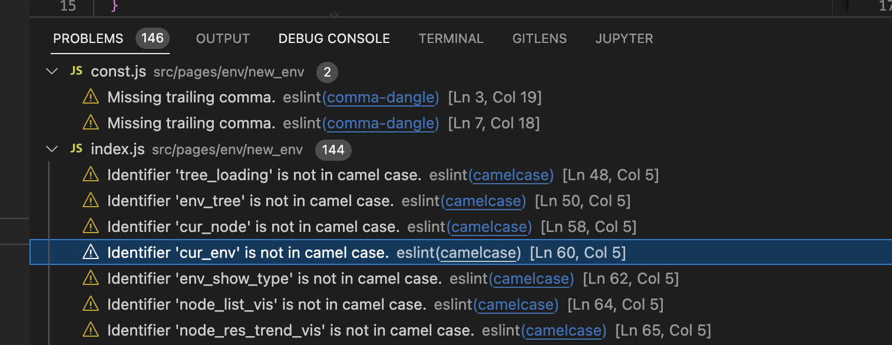
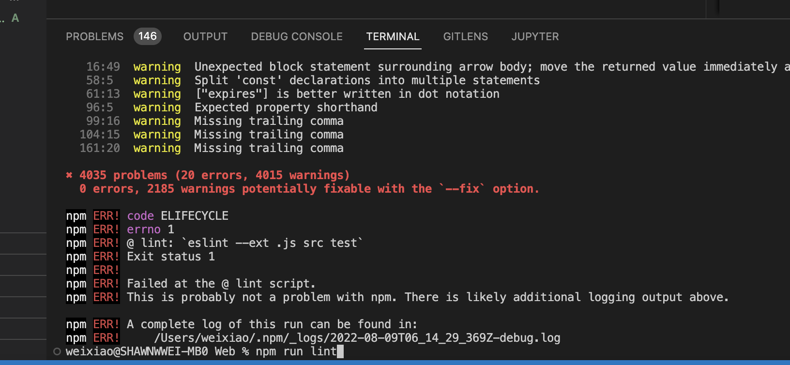
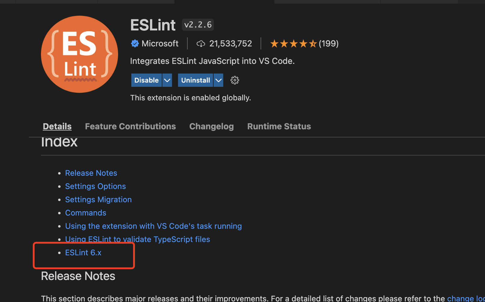
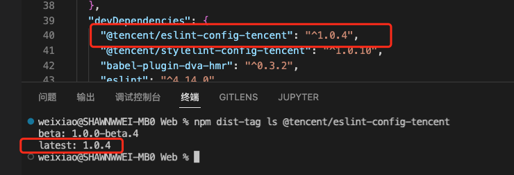
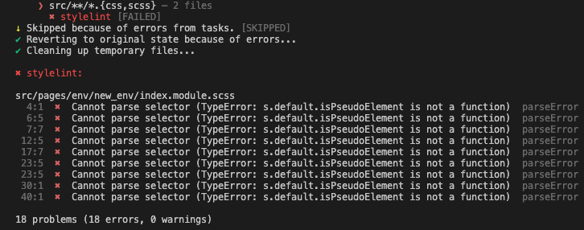

## 前端项目lint规范配置

### 前置内容

#### vscode lint拓展和node_modules中的lint依赖

以eslint为例，平时项目开发时，判断代码是否符合自定义eslint规范，通常有两种办法：

1. vs code中PROBLEMS中查看
   

2. 执行run lint操作，在TERMINAL中查看



而这两种检测方式生成的原因有所不同，PROBLEMS中的检测结果由vs code的eslint拓展生成，TERMINAL中的检测结果来源于node_modules中下载的eslint依赖。

检测方式的来源不同，必然带来两个思考：

1. 两种检测方式各有什么**独特用途**
2. 两种检测方式检测规则都依赖于.eslintrc*，**检测结果**会不会有什么不同

#### vs code的自动format

> 问题1——两种检测方式各有什么**独特用途**

通常在项目开发中，代码规范用eslint检测，而代码格式自动化用Prettier之类的拓展完成，但是这带来一个问题——Prettier格式化的规范和eslint不相同时，自动格式化后的代码无法通过eslint检测。

若调整Prettier规则，每次eslint规则变化时都要修改对应Prettier规则。

查阅[eslint官网](https://eslint.org/docs/latest/rules/)中的rules可以发现，很多规则是可以自动修复的，eslint的fix指令也能批量完成格式修复。vs code的eslint拓展同样具备自动修复的功能。

我们在项目中添加如下文件结构，可让代码在**保存的时候自动根据eslint规则format**：

```txt
├── .vscode
│ ├── settings.json // eslint/stylelint拓展配置
│ └── extension.json // 若没有安装相关拓展，打开vscode时弹出安装提示
```

settings.json配置如下：

```json
{
  "editor.formatOnSave": true,
  "editor.defaultFormatter": "dbaeumer.vscode-eslint",
  "editor.codeActionsOnSave": {
      "source.fixAll.eslint": true,
      "source.fixAll.stylelint": true
  },
  // "eslint.codeActionsOnSave.mode": "problems",
  "stylelint.snippet": [
    "css",
    "less",
    "postcss",
    "scss"
  ],
  "stylelint.validate": [
    "css",
    "less",
    "postcss",
    "scss"
  ]
}
```

extension.json配置如下：

```json
{
    "recommendations": [
        "dbaeumer.vscode-eslint",
        "stylelint.vscode-stylelint"
    ]
}
```

#### lint拓展和项目中lint依赖的差异

> 问题2——两种检测方式检测规则都依赖于.eslintrc*，**检测结果**会不会有什么不同

两种检测方式工作原理相同，只是运行的生命周期不一样，eslint拓展在**打开vs code**时运行，eslint依赖在执行**`npx eslint`**时执行。

但既然分开发布，且运行于不同的环境，必然存在**版本的差异性**，目前eslint拓展的规则是基于eslint 6.x，而当前eslint已经出到8.x版本。若项目的eslint依赖版本较新，.eslintrc*中配置了某些新特性，这部分新的规则特性eslint拓展无法解析，将导致eslint拓展运行出错，与其相关的功能(如上面说的自动format)也无法运行。




### 绿镜中的eslint规则配置

#### 结论

先说结论，绿镜中eslint部分：

+ 提交部分代码遵循`eslint-config-umi`和`@tencent/eslint-config-tencent`规范，`@tencent/eslint-config-tencent`在规则上的优先级更高
+ 提交时的eslint只校验修改的代码

#### 问题分析

绿镜项目前端脚手架为[dva](https://dvajs.com/guide/) ，eslint需要遵循eslint-config-umi规范，而项目发布需要通过蓝盾项目，蓝盾项目对于提交的前端代码，必须通过@tencent/eslint-config-tencent规则的校验。

总结下来，需要面对如下问题：

+ 需要同时遵守两套规范：eslint-config-umi、@tencent/eslint-config-tencent，而两套规范之间存在冲突
  + dva脚手架很久没更新了，eslint-config-umi规范依赖的解析器为babel-eslint，该解析器已经废弃，@tencent/eslint-config-tencent依赖的解析器为更新的@babel/eslint-parser
  + 解析器从babel-eslint到@babel/eslint-parser，有一些破坏性的升级，比如解析的AST树中部分jsx语法相关节点结构的变化，因此部分jsx相关的eslint插件可能会报错
  + 这带来的问题是，.eslintrc*中，我们无法在其extends配置中同时继承这两种规则，这将引起eslint拓展的报错
+ pre-commit是否需要全局的lint检测
  + 若完全遵循@tencent/eslint-config-tencent规则，代码eslint会有大量warning，虽然warning不影响提交，也不影响蓝盾项目对代码的检测，但并不是所有的warning都有自动修复，许多warning需要手动修改代码，这可能会导致现有的项目出bug
  + 老代码为了让项目成功发布，只解决了error级别的报错，warning级别的蓝盾不会报，所以也都没有处理
  + 参考和coding项目，或许应该采用边开发边改的方式，当新需求会修改某个文件时，再对改文件用新规则进行format，这样能保证在熟悉代码的情况下，让代码更规范


#### 两套规范的冲突问题

##### 解决冲突的配置方案

项目脚手架为dva，为保证其正确运行，自然要遵循eslint-config-umi规范，而遵循@tencent/eslint-config-tencent规范主要是为了项目能正常发布，因此我们主要关心的是@tencent/eslint-config-tencent规范的**rules部分**，既然两套规范存在冲突，配置时无法同时继承，那么是否能只继承eslint-config-umi规范，再获取@tencent/eslint-config-tencent规范的rules部分，对导出规则中的rules进行重写。

需要注意的是，我们直接用`require('@tencent/eslint-config-tencent')`获取的配置中没有rules，因为该规则继承自其他规则，需要沿着其estends配置的路线递归的向上找。最终.eslintrc.js配置如下:

```javascript
const path = require('path');

const getConfigCtxByPath = (dirPath, relativePath) => {
  const getCtxByPath = (tapPath) => {
    const { dir } = path.parse(tapPath);
    return {
      dir,
      content: require(tapPath),
    };
  };
  try {
    const tapPath = require.resolve(relativePath);
    return getCtxByPath(tapPath);
  } catch (err) {
    const fulPath = path.resolve(dirPath, relativePath);
    const tapPath = require.resolve(fulPath);
    return getCtxByPath(tapPath);
  }
};
// 递归获取eslint-config-xxx包中的rules配置
const getRulesByPkg = (pkgName) => {
  const getRulesByPath = (basePath, relativePath) => {
    const { dir, content: { rules = {}, extends: extendsArr = [] } } = getConfigCtxByPath(basePath, relativePath);
    const extendsRules = extendsArr.map(extendPath => getRulesByPath(dir, extendPath));
    return Object.assign({}, rules, ...extendsRules);
  };
  return getRulesByPath('', pkgName);
};

const config = {
  extends: ['umi'],
  settings: {
    react: {
      version: 'detect',
    },
  },
  rules: {
    ...getRulesByPkg('@tencent/eslint-config-tencent'),
    // 注意，eslint 拓展只支持6.x规则，不支持@tencent/eslint-config-tencent中camelcase的配置，为避免自动format功能失效，重写该配置
    camelcase: 'warn',
		...
  },
};

module.exports = config;

```

##### 规则相关问题及解决方案

获取`@tencent/eslint-config-tencent`全部规则并应用于项目后，会发现如下两个问题：

1. vscode eslint拓展检测报错，eslint node_modules依赖检测正常
2. 部分规则未达到预期效果

对于问题1，主要原因是之前提到的vscode eslint拓展和eslint依赖的基础eslint规则版本不一样，如`camelcase`规则参数的问题，这种需要我们在eslintrc中重写冲突的规则配置

对于问题2，如`react/jsx-indent`规则不能对jsx中大括号内的代码进行format，这类问题可以尝试用其他规则如`indent`代替实现，参见[issue](https://github.com/jsx-eslint/eslint-plugin-react/issues/3097#issuecomment-1203505047)

##### .eslintrc.js规则在`npm run start`时失效的原因

还需注意的一点是，和其他项目不同，.eslintrc.js配置并不会在`npm run start`时生效，因为dva脚手架的打包部分依赖于roadhog，而roadhog获取打包配置依赖于af-webpack，af-webpack源码中获取用户配置的文件af-webpack/lib/getConfig.js，其中有这么一段：

```javascript
  const eslintOptions = {
    formatter: _eslintFormatter.default,
    baseConfig: {
      extends: [require.resolve('eslint-config-umi')]
    },
    ignore: false,
    eslintPath: require.resolve('eslint'),
    useEslintrc: false
  }; // 用用户的 eslint 
....
// 读用户的 eslintrc
  const userEslintRulePath = (0, _path.resolve)(opts.cwd, '.eslintrc');
  if ((0, _fs.existsSync)(userEslintRulePath)) {
    try {
      const userRc = (0, _readRc.default)(userEslintRulePath);
      debug(`userRc: ${JSON.stringify(userRc)}`);

      if (userRc.extends) {
        debug(`use user's .eslintrc: ${userEslintRulePath}`);
        eslintOptions.useEslintrc = true;
        eslintOptions.baseConfig = false;
        eslintOptions.ignore = true;
      } else {
        debug(`extend with user's .eslintrc: ${userEslintRulePath}`);
        eslintOptions.baseConfig = _objectSpread({}, eslintOptions.baseConfig, userRc);
      }
    } catch (e) {
      debug(e);
    }
  }
....
```

可以看到，`npm run start`时进行eslint校验所依赖的规则，如果用户想配置，**只能在项目中新建名为.eslintrc的文件，.eslintrc.json或.eslintrc.js都不会生效**。

##### 是否要让配置的.eslintrc.js规则在`npm run start`时生效

若想要.eslintrc.js规则在`npm run start`时生效，解决的办法很简单，首先创建eslint-config.js文件，文件内容复制粘贴自.eslintrc.js，再创建.eslintrc文件，内容如下：

```json
{
  "extends": ["./eslint-config.js"]
}
```

但这带来了一个问题，之前提到过很多老代码都不符合@tencent/eslint-config-tencent规范，部分代码甚至会报warning，若让.eslintrc.js规则在`npm run start`时生效，为了项目的正确运行，我们必须修改报错部分，而前面提到过，这样会有项目出bug的风险。

**因此，还是只采用.eslintrc.js配置的方案，不让其在`npm run start`时生效**


#### pre-commit全局lint检测的问题

目前git commit之前会执行全局的lint检测，和绿镜`npm run start`行为不同的是，.eslintrc.js是会对lint操作生效的。若pre-commit钩子执行全局lint检测，未修改代码也要检测，为了commit成功去修改其他代码的行为前面已经提到过可能会出问题，因此**pre-commit应只检测修改的代码**。

##### lint-staged

解决该问题比较简单，只需添加lint-staged依赖，pre-commit执行lint-staged，只检测提交内容的代码规范。当前配置如下：

```json
{
  "private": true,
  "lint-staged": {
    "src/**": [
      "eslint"
    ]
  },
  "scripts": {
    "start": "roadhog server",
    "build": "roadhog build",
    "lint": "eslint --ext .js src test",
    "fix": "eslint --fix --ext .js src test",
    "precommit": "lint-staged",
    "setport": "set PORT=3538&&roadhog dev",
    "develop": "set PORT=3539&&roadhog dev"
  },
}
```


#### 一些疑惑

蓝盾项目一些规则并不存在于发布的@tencent/eslint-config-tencent包中，如`no-return-assign`规则，官方项目中有[issue](https://git.woa.com/standards/javascript/issues/229)提到了该规则被采纳，但发布包中的配置里并没有该规则，而蓝盾项目确实检测了该规则。

不知道新增规范是否发布到@tencent/eslint-config-tencent包，或者是发布到了其他地方。。




### 绿镜中stylelint规则的配置

和eslint配置相似，工作分两步：

1. 下载vs code stylelint拓展，修改项目vs code配置
2. 配置stylelint规则

步骤1中项目vs code配置可参考前面，规则配置中遇到的问题主要在步骤2

#### 基本配置

当前开发环境主要是`scss-module`，且需要满足项目规范`@tencent/stylelint-config-tencent`。

为实现`scss-module`，需分别继承`stylelint-config-recommended-scss`（这里不用`stylelint-config-standard-scss`是因为有坑，后面会提到）和`stylelint-config-css-modules`。

外加`css`属性排序，`.stylelintrc.js`代码如下

```javascript
module.exports = {
  extends: [
    '@tencent/stylelint-config-tencent',
    'stylelint-config-recess-order',
    'stylelint-config-recommended-scss',
    'stylelint-config-css-modules',
  ],
  // stylelint-config-recommended-scss 规范中已添加相关解析器规则，无需再次添加
  // overrides: [{
  //   files: ['**/*.scss'],
  //   customeSyntax: require('postcss-scss'),
  // }],
  rules: {
    /**
     * 关于顺序，规则来源于stylelint-order，未针对scss进行适配，重写后的新顺序如下：
     * 1. css3 变量无疑放在第一位，无论是scss变量还是用户定义的样式属性都会用到
     * 2. scss的变量放在第二，scss的at-rules和样式属性都会用到
     * 3. at-rules应在用户属性前面，at-rules优先级较低，可以被样式属性覆盖，放在后面不太合适
     * 4. 用户定义的属性
     * 5. scss嵌套的样式应放在最后
     */
    'order/order': [
      'custom-properties',
      'dollar-variables',
      'at-rules',
      'declarations',
      'rules',
    ],
    // stylelint-scss 默认规则会导致@import .scss文件报错
    // 对此问题官方推荐scss引入用@use语法，但目前项目脚手架不支持高版本scss，因此该规则默认排除.scss
    'scss/at-import-partial-extension': ['always', null, { except: ['scss'] }],
    // 该规则会影响scss @import方法的正常使用
    'no-invalid-position-at-import-rule': null,
    'block-opening-brace-newline-after': 'always',
    'block-closing-brace-newline-before': 'always',
  },
};

```

#### 配置时遇到的坑

如果上面相关依赖全部下载最新的，会发现vscode拓展正常，但stylint依赖会报以下错误



这主要是绿镜框架scss相关依赖的问题，绿镜中使用scss需要下载node-sass，而sass官方目前主要使用dart-sass作为预处理器，最新版本的stylelint和sass官方保持一致，因此解析时会有报错

为了stylelint的正常使用，本地stylelint依赖采用`^14.8`版本